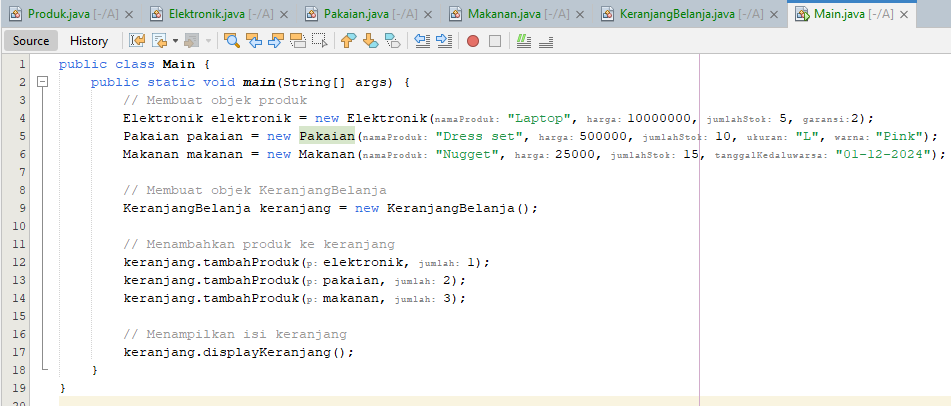

# Praktikum5

# 1. *Kelas Produk (Super Class)*
.

  Kelas ini berfungsi sebagai kelas induk untuk semua jenis produk.
# Properti:
  -namaProduk: Nama produk (tipe String).
  
  - harga: Harga produk (tipe double).
  
  - jumlahStok: Jumlah produk yang tersedia dalam stok (tipe int).

- Constructor: Menginisialisasi semua properti.

- Method displayInfo(): Menampilkan informasi dasar tentang produk, yaitu nama, harga, dan jumlah stok.

# *2. Kelas Turunan (Subclass)*
  Subclass ini memperluas kelas Produk dan menambahkan properti spesifik untuk masing-masing jenis produk.

# *a. Kelas Elektronik*
.

  - Properti Tambahan: garansi (tipe int), yang menunjukkan lamanya garansi dalam tahun.
  
  - Constructor: Menginisialisasi properti dari Produk dan juga garansi.
  
  - Method displayInfo(): Meng-override method displayInfo() untuk menampilkan informasi garansi tambahan.

# *b. Kelas Pakaian*
.

  - Properti Tambahan:
      - ukuran (tipe String): Ukuran pakaian, seperti S, M, L, dll.

      - warna (tipe String): Warna pakaian.
  - Constructor: Menginisialisasi properti dari Produk dan menambahkan ukuran dan warna.

  - Method displayInfo(): Meng-override method displayInfo() untuk menampilkan ukuran dan warna pakaian.

# *c. Kelas Makanan*
.
    
- Properti Tambahan: tanggalKedaluwarsa (tipe String), menunjukkan tanggal kedaluwarsa produk.
    
- Constructor: Menginisialisasi properti dari Produk dan menambahkan tanggalKedaluwarsa.
  
- Method displayInfo(): Meng-override method displayInfo() untuk menampilkan tanggal kedaluwarsa.

# *3. Kelas KeranjangBelanja*
.
.

  Kelas ini mewakili keranjang belanja yang menyimpan produk-produk yang ditambahkan oleh pengguna.
- Properti: daftarProduk (tipe ArrayList<Produk>), digunakan untuk menyimpan daftar produk yang ditambahkan ke keranjang.
  
- Method tambahProduk():
  - Menambahkan produk ke keranjang jika jumlah stok mencukupi.
          
  - Mengurangi jumlah stok produk jika produk berhasil ditambahkan.
        
  - Menampilkan pesan apakah produk berhasil ditambahkan atau jika stok tidak mencukupi.
        
- Method hitungTotalBelanja():
  - Menghitung total harga semua produk dalam keranjang.
        
- Method displayKeranjang():
  - Menampilkan semua produk dalam keranjang dan total harga belanja.

# *4. Kelas Main*  
.
        
  Kelas utama yang menjalankan program.
- Membuat Objek Produk:
  - Contoh objek: Elektronik, Pakaian, Makanan.

  - Membuat Objek KeranjangBelanja: Keranjang belanja tempat produk ditambahkan.
    
  - Menambahkan Produk ke Keranjang: Menggunakan method tambahProduk().
    
  - Menampilkan Isi Keranjang: Menggunakan method displayKeranjang() untuk menampilkan produk yang ada dalam keranjang dan total belanja.

# *5. Hasil Output*  
.

